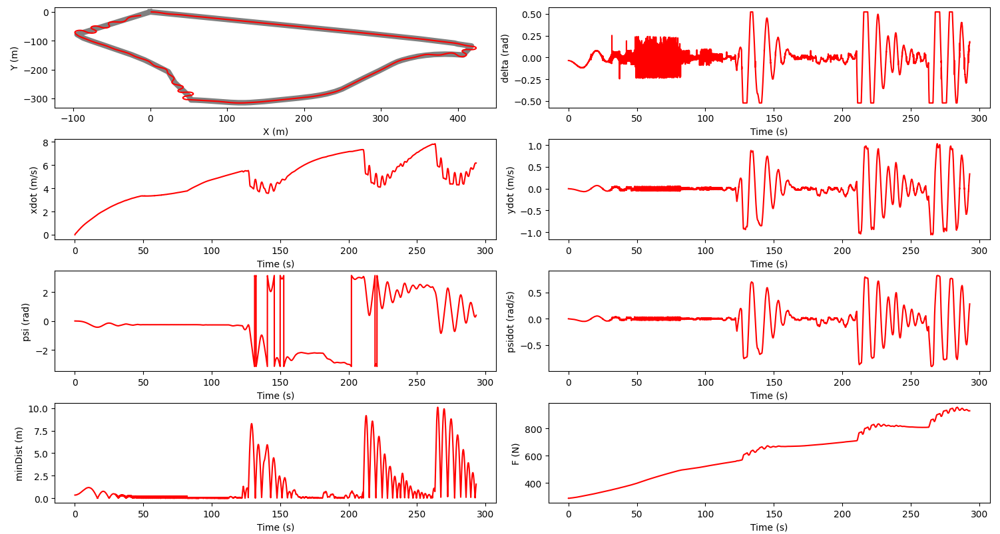

# Automotive-Control-Methods

## PID

### Method
Implemented two PID controllers for lateral and longitudinal controls respectively.Gains were tuned using the [twiddle algorithm](controllers/main/pid_design.py). A custom signed cross-track error was used in the lateral control and a differential error was used for the longitudinal controller.

### Results
Trajectory following and control performance are shown below: (find all attempts [here](assets/img/PID))

Simulation video is shown below:
https://github.com/lokichubs/Automotive-Control-Methods/blob/main/assets/vid/PID/PID_sim_vid.mp4